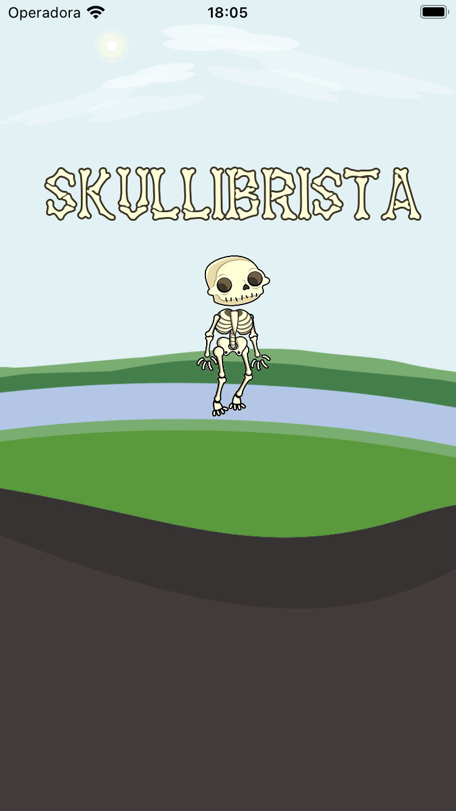

# Skullibrista
> Aplicativo para desenvolvimento Swift/iOS

* Linguagens
    * Swift 5.5

* Auto Layout
    * Autoresizing
    * Constraint
    * Assets

* Components
    * UIView
    * UILabel
    * UIImage
    * UIButton
    * Acelerômetro
    * Giroscópio
    * DeviceMotion

    
## Snapshots

  
 

 
